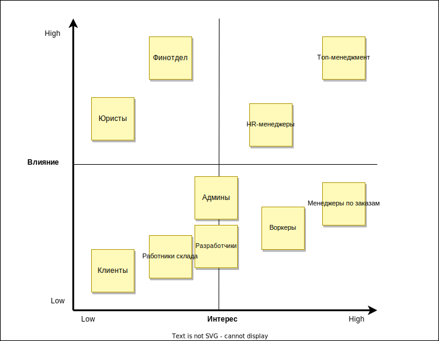

## Домашнее задание, урок 3

- [1. Стейкхолдеры](#p1)
    - [1.1. Матрица стейкхолдеров](#p1.1)
    - [1.2. Консёрны стейкхолдеров](#p1.2)
- [2. ES, Data model, Subdomains, Bounded contexts](#p2)
    - [2.1. ES](#p2.1)
    - [2.2. Data model](#p2.2)
    - [2.3. Core domain chart](#p2.3)
    - [2.4. Bounded contexts](#p2.4)
- [3. Характеристики и ограничения](#p3)
- [4. Архитектурный стиль](#p4)
- [5. Базы данных и стили отдельных сервисов](#p5)
- [6. Коммуникации](#p6)
- [7. Фитнес-функции](#p7)
- [8. ADR](#p8)

### <a name="p1">1. Стейкхолдеры</a>
- Топ-менеджмент
- Менеджеры по заказам
- HR-менеджеры
- Работники склада
- Финотдел
- Разработчики
- Админы
- Юристы
- Клиенты
- Воркеры

Помимо приведённых стейкхолдеров с их консёрнами, я посчитал целесообразным добавить ещё три типа: во-первых разбил "менеджеров" на "менеджеров по заказам", "HR-менеджеров" и "работников склада" (они работают в разных контекстах с разными ограничениями, логично предположить, что у них будут разные консёрны - в исходном списке приведены консёрны менеджеров по заказам), во-вторых добавил воркеров - они тоже являются активными пользователями системы и наверняка у них тоже есть свои потребности.  
Я думал об отдельном добавлении овнеров, но решил, что топ-менеджмент полностью представляет эту категорию.

#### <a name="p1.1">1.1. Матрица стейкхолдеров</a>
  
[pdf](resources/stakeholder_matrix.pdf)  
[diagrams.net](https://drive.google.com/file/d/15FeH8LZ2Zgjz3dh9IWFNup20w_yG_6x9/view?usp=sharing)

На матрице стейкхолдеров я разместил их так:
- высокое влияние / высокий интерес:
    - Топ-менеджмент - потому что они тут главные;
    - HR-менеджеры - потому что они будут работать со скорингом, на котором топ-менеджмент специально заострил внимание, как на особо важном элементе;
- высокое влияние / низкий интерес:
    - Финотдел, Юристы - соблюдение CatFinComplience - их требования нужно учитывать;
- низкое влияние / высокий интерес:
    - Воркеры, Менеджеры по заказам - эти группы будут максимально вовлечены в работу с заказами, к ним нужно будет прислушиваться;
- низкое влияние / низкий интерес:
    - Работники склада, Клиенты;
- NA
    - Разработчики, Админы - непонятно, куда их отнести, влияние у них скорее всего низкое.

#### <a name="p1.2">1.2. Консёрны стейкхолдеров</a>
  
[pdf](resources/concerns.pdf)  
[diagrams.net](https://drive.google.com/file/d/10JTt620NtV4xx8Z3GYQKPZYB8qwb6omD/view?usp=sharing)  

Все консёрны взяты из описания домашки, кроме трёх новых стейкхолдеров - для них типовое "Чтобы всё работало" (за неимением информации).

### <a name="p2">2. ES, Data model, Subdomains, Bounded contexts</a>

В этой части у меня канули в лету нотификации (наконец-то), и добавился поддомен мотивации менеджеров.

#### <a name="p2.1">2.1. ES</a>
  
[pdf](resources/es_3.pdf)  
[diagrams.net](https://drive.google.com/file/d/1kFGgCKEjwNksMod6N71gr6FPWb4FUoCS/view?usp=sharing)  

#### <a name="p2.2">2.2. Data model</a>
  
[pdf](resources/data_model.pdf)  
[diagrams.net](https://drive.google.com/file/d/16HjEgXSPFZx7rv9jGFUSi8MuC332UagK/view?usp=sharing)  

#### <a name="p2.3">2.3. Core domain chart</a>
  
[pdf](resources/core_domain_chart.pdf)  
[diagrams.net](https://drive.google.com/file/d/1SOJzM0_wrH3GQN2o1Lg3q8JQZM3tZ-31/view?usp=sharing)  

#### <a name="p2.4">2.4. Bounded contexts</a>
  
[pdf](resources/bounded_contexts.pdf)  
[diagrams.net](https://drive.google.com/file/d/1oQSYWjJGjhYj_IBJUwgDWk7gvrEyI-2z/view?usp=sharing)  

### <a name="p3">3. Характеристики и ограничения</a>
  
[pdf](resources/chracteristics.pdf)  
[diagrams.net](https://drive.google.com/file/d/1CFkF24O8C2SHCk5MRhZXOuSpVWD3zstX/view?usp=sharing)  

### <a name="p4">4. Архитектурный стиль</a>

По совокупности характеристик был выбран микросервисный архитектурный стиль. Сервисы выделялись последовательным рассмотрением ВС:
- __система матчинга воркеров и заказов__ Этот BC будет делать отдельная команда со своим видением и языком, следовательно - это отдельный сервис;
- __HR-система__ У этого BC специальные требования по Security, связанные с вероятными DDoS атаками, а также он выделяется особыми требованиями, связанными с учащённым, относительно остальной системы, релизным циклом, это будет отдельный сервис;
- __инвентаризация и склад__ Это будет покупное готовое решение, так что это отдельный сервис;
- __оказание услуги__ У этого BC ожидается очень высокая нагрузка, по сравнению с остальными частями системы, кроме того, у него есть ряд квалити-оф-лайф характеристик для клиентов, так что это отдельный сервис;
- __оплата услуг__, __выплаты воркерам__ - характеристики и ограничения у этих BC одинаковые, семантически они тоже близки, так что нет смысла разносить их по отдельным сервисам - это будет один сервис;
- __система контроля качества__ и __система ставок__ - эти BC имеют одинаковые характеристики и ограничения, однако о системе ставок было сказано, что она практически не будет меняться. Про систему контроля качества, с другой стороны, вообще почти ничего не известно - есть даже предположение, что она не отдельный BC, а является частью оказания услуги (и позже туда переедет).  
Кроме того, есть пожелание менеджеров о "секретности" системы ставок. Основывать решение на этом пожелании не стоит, но оно может стать последней песчинкой при принятии окончательного решения при прочих равных. Таким образом это будут два разных сервиса.  
  
[pdf](resources/services.pdf)  
[diagrams.net](https://drive.google.com/file/d/1eegBnlCchSmqiy4u5LIqZX0KGfQLfFO7/view?usp=sharing)  

### <a name="p5">5. Базы данных и стили отдельных сервисов</a>
Сразу оговорюсь, что по умолчанию буду выбирать реляционные СУБД - из-за их надёжности, простоты, и (как следствие простоты) - доступности любому новому разрабу с улицы. Короче говоря, они все плюс-минус одинаковые, и их более-менее знают все.  
Стиль по умолчанию будет монолитный, также из-за простоты.

- __система матчинга воркеров и заказов__ - архитектурный стиль - Pipeline (т.к. алгоритмы матчинга представляют из себя набор шагов, похожий на map-reduce), БД - реляционная.

- __HR-система__ - из-за **evolvability** плохо подходят монолиты, лучше всего консёрнам топ-менеджмента подойдёт стиль microkernel - особенно с учётом будущей продажи сервиса (тогда под каждого покупателя будет просто допиливаться отдельный плагин/набор плагинов). Также, потенциальная продажа сервиса приведёт к большим объёмам данных и необходимости шардинга, что в совокупности со спецификами потенциальных покупателей (т.е. неструктурированностью данных) делает подходящей документарную БД.

- __оплата услуг и выплаты воркерам__ - модульный монолит, с отдельным модулем на каждый BC. БД - строго реляционная, для соблюдения консистентности

Остальные сервисы будут layered-монолитами с реляционными БД.

### <a name="p6">6. Коммуникации</a>
- __система матчинга воркеров и заказов__ - этой системе требуются данные о новых воркерах, а от неё требуется назначить воркера на задачу. Получение данных о воркерах не требует ответа и может быть асинхронным. Назначение же воркера на заказ напрямую связано с выполнением заказа и должно произойти как можно быстрее, так что это будет синхронный блокирующий запрос;
- __HR-система__ - этот сервис функционально с другими не связан, он только стримит данные о новых воркерах в сервисы оказания услуг, платежей и матчинга. Ответа эти вызовы также не требуют, так что тут будет event-driven;
- __оказание услуги__ - у этого сервиса есть пачка исходящих бизнес-событий об изменении статуса заказа, они консьюмятся сервисами ставок, платежей, контроля качества и склада, ответа и скорости не требуют (будут асинхронными), тут будет event-driven. Помимо этого, для сервиса склада будут стримиться данные о новых типах услуг, чтобы подбирать правильные расходники - этот вызов также будет асинхронным.

  
[pdf](resources/communications.pdf)  
[diagrams.net](https://drive.google.com/file/d/1CpNw1HMtECkVlEceCArBXP3FpXs1xKkx/view?usp=sharing)  

### <a name="p7">7. Фитнес-функции</a>

- __общие для всей системы__
    - проверка покрытия тестами не ниже 90%;   
    - проверка периодичности релиза не реже раза в месяц. Обсудить с девопсом, организующим CI, а также с менеджерами, как это лучше сделать;   
 
- __система матчинга воркеров и заказов__ 
    - проверка периодичности релиза не реже раза в неделю. Обсудить с девопсом, организующим CI, а также с менеджерами, как это лучше сделать;   
    - анализ метрик coupling и cohesion;   

- __HR-система__ 
    - прохождение нагрузочных тестов;   
    - организовать pen-testing (ну, или нет. Это дорого - нужно согласовывать оправданность с бизнесом);   
    - анализ метрик coupling и cohesion;   

- __оказание услуги__
    - прохождение нагрузочных тестов scalability и elasticity;  
    - проверять руками юзабилити;   
    - собирать фидбэк от клиентов;   

- __оплата услуг__, __выплаты воркерам__
    - проверять руками на CatFinComplience;   

### <a name="p8">8. ADR</a>

[ADR](./ADR.md)  
