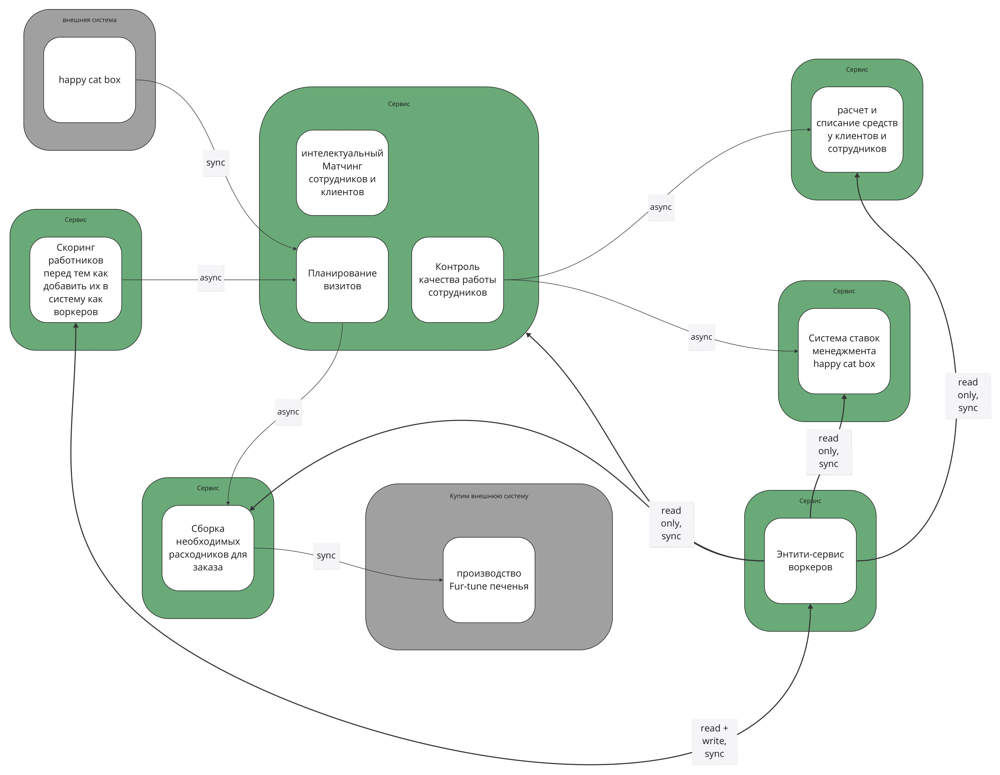

## <a name="root">Домашнее задание, урок 4</a>

- [1. Задание](#p1)
- [2. Instability](#p2)
    - [2.1. Система контроля качества, Система матчинга воркеров](#p2.1)
    - [2.2. Энтити-сервис воркеров](#p2.2)
    - [2.3. Расчет и списание средств у клиентов и сотрудников](#p2.3)
- [3. Изменение системы](#p3)
- [4. План работ](#p4)

### <a name="p1">1. Задание</a>
Для задания я взял готовую систему, поскольку нулевую домашку не сделал.  
Исходная система:
  
[pdf](resources/system.pdf)  

Итоговая система:
  
[pdf](resources/services.pdf)  
[diagrams.net](https://drive.google.com/file/d/1eegBnlCchSmqiy4u5LIqZX0KGfQLfFO7/view?usp=sharing)  

По сравнению с исходной системой изменились 4 сервиса:
- Система контроля качества - отделена от управления заказами;
- Энтити-сервис воркеров - объединён со скорингом работников (HR-система);
- Система матчинга воркеров - отделена от управления заказами;
- Расчет и списание средств у клиентов и сотрудников - разделён на два BC в рамках одного сервиса.

### <a name="p2">2. Instability</a>
#### <a name="p2.1">2.1. Система контроля качества, Система матчинга воркеров</a>
Поскольку изначально этот функционал был реализован в одном сервисе, instability для них будет одинаковым.
Сервис имеет 3 входящих связи (happy cat box, скоринг, энтити-сервис воркеров), и 3 исходящих (ставки, склад, фин. рассчёты). Значит его instability до изменений был равен `3 / (3 + 3) = 0.5`.
Для связанных сервисов:
- happy cat box - `1 / (1 + 0) = 1` - не имеет значения, так как это внешний сервис;
- скоринг - `1 / (1 + 1) = 0.5`;
- энтити-сервис воркеров - `5 / (5 + 1) = 0.83`;
- ставки - `0 / (0 + 2) = 0`;
- склад - `1 / (1 + 2) = 0.33`;
- фин. рассчёты - `0 / (0 + 2) = 0`.

#### <a name="p2.2">2.2. Энтити-сервис воркеров</a>
Сервис имеет 1 входящую связь (скоринг), и 5 исходящих (ставки, склад, фин. рассчёты, скоринг, управление заказами). Значит его instability до изменений был равен `5 / (5 + 1) = 0.83`.
Для связанных сервисов:
- скоринг - `1 / (1 + 1) = 0.5`;
- ставки - `0 / (0 + 2) = 0`;
- склад - `1 / (1 + 2) = 0.33`;
- фин. рассчёты - `0 / (0 + 2) = 0`;
- управление заказами - `3 / (3 + 3) = 0.5`.

#### <a name="p2.3">2.3. Расчет и списание средств у клиентов и сотрудников</a>
Сервис имеет 2 входящих связи (управление заказами, энтити-сервис воркеров), и не имеет исходящих. Значит его instability до изменений был равен `0 / (0 + 2) = 0`.
Для связанных сервисов:
- управление заказами - `3 / (3 + 3) = 0.5`;
- энтити-сервис воркеров - `5 / (5 + 1) = 0.83`.

Обращает на себя внимание энтити-сервис воркеров - у него довольно высокий instability.

### <a name="p3">3. Изменение системы</a>
Изменять систему мы будем согласно моделям, [построенным в третьем уроке](../lesson_3/#p2).

Функционал контроля качества будет отделён от обработки заказа, потому что это отдельный BC с отличающимися характеристиками. То же самое касается и матчинга. При этом контроль качества будет соединён с обработкой заказа асинхронно (будет генериться событие об изменении статуса заказа в топик - очереди здесь не подойдут, потому что событие нужно в нескольких местах). А матчинг будет общаться с обработкой синхронным reques-response, для ускорения работы.
Также при вынесении матчинга изменится архитектурный стиль этой части - вместо модуля в монолите это будет pipeline, а данные контроля качества и матчинга переедут в отдельные базы.

Энтити-сервис воркеров будет объединён с сервисом скоринга в новом HR-сервисе - так мы избавимся от синхронной связи между этими сервисами. Воркеров всё равно может мутировать только сервис скоринга. Информация о воркерах будет продюситься HR-сервисом в топик для всей системы.
Кроме того, архитектурный стиль скоринга изменится на microkernel, а тип БД на документарную

Расчет и списание средств у клиентов и сотрудников останется одним сервисом с одной БД, но при этом разделится на два модуля - `оплата услуг` и `выплаты воркерам`, потому что это разные боундед-контексты.

### <a name="p4">4. План работ</a>
Для этой части предположим, что у нас есть люди, но нет опыта.

1. Вынесем контроль качества из обслуживания заказа. Этот функционал некритичен, и от него напрямую ничего не зависит - его отказ даже на несколько дней на бизнес особо не повлияет.
Поскольку архитектурно он не изменится (как был монолитом, так и останется), схема БД также не изменится, то для его переноса используем подход Tactical Forking.

2. Вторым шагом разделим "Расчет и списание средств" на два модуля - этот функционал менее важен, чем два оставшихся. Схема БД скорее всего при разделении не изменится, а вот код перепишется существенно, поэтому будем использовать паттерн "Strangler Fig Application".

3. Следующим шагом сольём энтити-сервис воркеров с сервисом скоринга. Функционал важный, нужно иметь возможность сделать откат. Для перехода добавим к схеме скоринга схему энтити-сервиса, а затем реализуем логику энтити сервиса в скоринге. Затем синкнем данные из старого сервиса, отключим его, а новый запустим. Эта доработка сложной не выглядит - логика энтити сервиса очень простая - это обычный круд.

4. Четвёртым шагом изменим стиль и БД скоринга. Это критически важный функционал, поэтому важно иметь возможность откатить его к старой версии, если что-то пойдёт не так. Поскольку подразумевается изменение схемы БД, будем использовать паттерн "Change Data Capture". Для соблюдения существующих контрактов нужно заранее приготовить адаптер данных.

5. В последнюю очередь отделим матчинг от обработки заказа. Схема БД при этом (вероятно) не изменится, зато изменится архитектурный стиль, поэтому будем использовать паттерн SFA.

